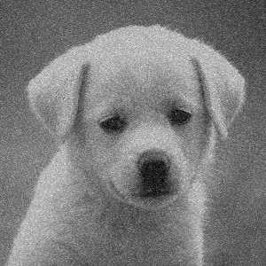

### Non-local means image denoising done efficiently in Futhark.
With special bindings in modern C++.

To try backends other than Futhark's CUDA one, edit ``/lib/futhark/make_futhark.sh`` accordingly.
